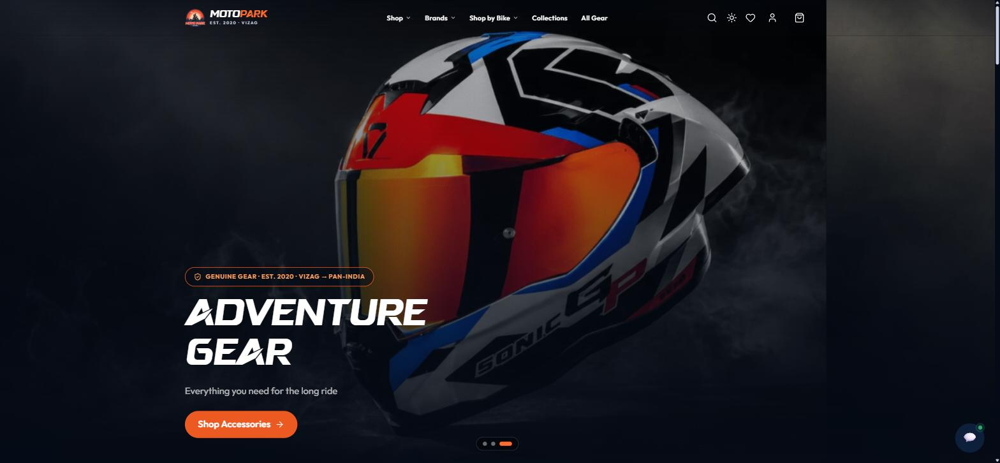
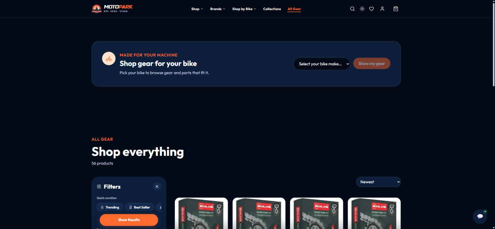
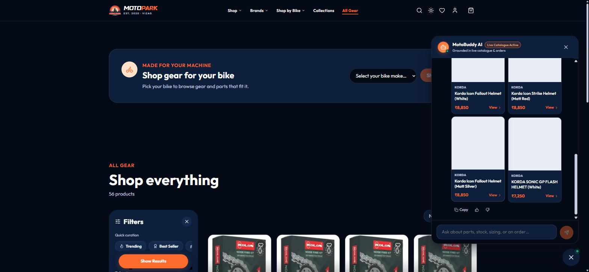

# MotoPark Vizag

**A production motorcycle-gear e-commerce platform with a grounded, tool-calling AI shopping assistant.**

[](https://motoparkvizag.in)


---

## Screenshots

<p align="center">
  
</p>
<p align="center">
  
  
</p>

---

## Overview

MotoPark is a full-stack e-commerce platform for a Visakhapatnam-based motorcycle-gear retailer, built and shipped independently — storefront, custom admin CMS, and REST API. It's a working production system: real customers, real Razorpay payments, real inventory.

Built into it is **MotoBuddy**, a grounded, tool-calling AI shopping assistant. Rather than a "ChatGPT wrapper," MotoBuddy only states facts it retrieves from live database calls — it cannot invent stock levels, prices, or order statuses. It combines semantic product search (MongoDB Atlas Vector Search) with a provider-agnostic LLM layer (Google Gemini / OpenAI, swappable via a single environment variable) and per-call cost/latency observability.

**Live:** [motoparkvizag.in](https://motoparkvizag.in)

---

## Table of Contents

- [Key Features](#key-features)
- [Tech Stack](#tech-stack)
- [Architecture](#architecture)
- [MotoBuddy — AI Shopping Assistant](#motobuddy--ai-shopping-assistant)
- [Authentication](#authentication)
- [Payment Flow](#payment-flow)
- [Folder Structure](#folder-structure)
- [API Overview](#api-overview)
- [Getting Started](#getting-started)
- [Environment Variables](#environment-variables)

---

## Key Features

**Storefront**
- Product browsing with category/brand/price/size/color filtering, full-text search, and faceted filters (single `$facet` aggregation)
- Cart and wishlist with guest support (`sessionStorage`) that merges into the account on login
- Guest and authenticated checkout, saved addresses
- Razorpay online payments (UPI, cards, netbanking) with a checkout flow that survives cross-device payment (see [Payment Flow](#payment-flow))
- Email OTP login and email/password login
- PWA: installable, offline asset caching via Workbox

**MotoBuddy AI Assistant**
- Natural-language product search ("something to keep my gear dry in the rain") via text embeddings + vector search
- Grounded Q&A on stock, order status, return eligibility, and fitment — every answer traces back to a real database call
- Admin observability dashboard: per-call cost, p50/p95 latency, token usage, tool-invocation frequency, resolution rate

**Admin CMS**
- Product, inventory, and order management with CSV bulk import
- Drag-and-drop **Home Builder** controlling the storefront's section layout without a deploy
- Carousel, navbar, offers, video showcase, and collections management
- AI usage dashboard (MotoBuddy's observability data, rendered)

**Engineering / hardening**
- Helmet + CSP, CORS allow-listing, `express-rate-limit` (global + per-route), `express-mongo-sanitize`
- Idempotent Razorpay webhook handling with a unique partial index resolving race conditions between the browser and the webhook
- Server-side price recomputation on every order (never trusts client-submitted totals)
- Layered client-side cache (in-memory → sessionStorage → network) with in-flight request de-duplication

---

## Tech Stack

| Layer | Technology |
|---|---|
| Frontend | React 19, React Router 7, Vite 7, Framer Motion, Lenis (smooth scroll), Vite PWA / Workbox |
| Backend | Node.js, Express, MongoDB (Mongoose 9), JWT auth, bcrypt |
| AI | OpenAI SDK (shared OpenAI-compatible interface for Gemini + OpenAI), MongoDB Atlas Vector Search, text embeddings (3072-dim / 1536-dim) |
| Payments | Razorpay (order creation, HMAC-SHA256 signature verification, webhooks) |
| Media | Cloudinary (image/video CDN + transforms) |
| Email | Resend (OTP + transactional email) |
| Infra | Vercel (frontend), Railway (backend API), MongoDB Atlas |
| Hardening | Helmet, CORS allow-list, express-rate-limit, express-mongo-sanitize, compression |

---

## Architecture

```
Browser (React 19 SPA, PWA)
   │
   ├── Static hosting: Vercel (SPA rewrites, immutable asset cache)
   ├── Service Worker (Workbox): route-based runtime caching
   │
   └── HTTPS REST ────────────────►  Express API (Railway)
                                        │
                                        ├── Helmet + CSP, CORS allow-list, compression
                                        ├── express-rate-limit (global + per-route)
                                        ├── JWT auth (admin + user middleware)
                                        ├── Controllers → Mongoose Models → MongoDB Atlas
                                        │      │
                                        │      └── backend/ai/  (MotoBuddy module)
                                        │             ├── agent/loop.js      tool-calling loop
                                        │             ├── agent/tools.js     grounded DB reads
                                        │             ├── search/vectorSearch.js  Atlas $vectorSearch
                                        │             └── providers/         Gemini | OpenAI (swap via env)
                                        │
                                        ├── Cloudinary (media CDN)
                                        ├── Razorpay (order create + signature verify + webhook)
                                        └── Resend (OTP / transactional email)
```

---

## MotoBuddy — AI Shopping Assistant

MotoBuddy is a self-contained module (`backend/ai/`) on top of the same Express API and MongoDB data the storefront uses — no separate service, no synthetic data.

**Design principle:** the model never states a fact it didn't get from a real database call. Same instinct as the Razorpay flow — verify server-side, never trust the model's memory.

| Capability | How |
|---|---|
| Semantic product search | Query → embedding → MongoDB Atlas `$vectorSearch` (cosine similarity) → ranked real products |
| Grounded tool-calling | 6 function-calling tools: search products, get product details, check stock, get order status, check return eligibility, check fitment |
| Identity-gated order lookups | Order/return tools require a matching phone or email before returning any data |
| Provider abstraction | Gemini (`gemini-2.5-flash` + `gemini-embedding-001`, free tier, default) and OpenAI (`gpt-4o-mini` + `text-embedding-3-small`) behind one interface — swap vendor via a single `AI_PROVIDER` env var, zero business-logic changes |
| Rate-limit resilience | An intent router serves plain browse queries with embeddings only (no chat-model call); retry-with-backoff and graceful degradation under quota limits |
| Observability | Every provider call logs tokens, cost (integer micro-USD), latency, tools invoked, and whether the query resolved — surfaced on an admin dashboard |
| Evaluation | A golden-query harness (`backend/ai/eval/golden.json`) reports a pass rate against expected tool calls |

```
backend/ai/
├── config.js                 provider/model/pricing knobs (env-driven)
├── providers/
│   ├── openai.js              OpenAI SDK client (only file that imports it)
│   ├── gemini.js               Gemini via its OpenAI-compatible endpoint
│   └── index.js                 getProvider() factory — swap via AI_PROVIDER
├── search/
│   ├── embed.js                embedding helper + cost logging
│   ├── vectorSearch.js         $vectorSearch aggregation over products
│   └── backfill.js             builds/rebuilds the Atlas vector index
├── agent/
│   ├── tools.js                grounded tool registry (real DB reads only)
│   ├── systemPrompt.js         anti-hallucination guardrails
│   └── loop.js                 provider-agnostic agent loop
├── obs/
│   ├── logCall.js              cost + latency + persistence
│   └── eval.js                 runs golden.json, prints pass-rate report
└── aiController.js             POST /api/ai/chat · POST /api/ai/search
```

---

## Authentication

Two independent auth systems:

**Admin** — email/password checked against environment-stored credentials (`ADMIN_EMAIL` + a bcrypt hash), with a timing-attack mitigation (bcrypt always runs, even on an unknown email, against a dummy hash of the same cost factor, so response time can't leak whether the email exists). On success, a 24-hour JWT is issued. An in-memory revocation list supports logout; a periodic sweep purges expired entries. Login is rate-limited to 10 attempts / 15 minutes / IP.

**Customer** — email OTP (6-digit code, 10-minute expiry, sent via Resend) or email + bcrypt-hashed password. A guest-friendly `optionalAuth` middleware attaches user identity when a valid token is present and falls back to guest checkout otherwise; a stricter `requireUserAuth` guards order history.

---

## Payment Flow

1. `POST /api/payment/create-order` — server recomputes the amount from live DB prices (never trusts the client total), creates a Razorpay order.
2. Razorpay checkout opens client-side; customer pays (UPI, card, netbanking).
3. `POST /api/payment/verify` — recomputes the HMAC-SHA256 signature server-side with the Razorpay secret and compares against what the client returned; rejects on mismatch.
4. `POST /api/orders` — persists the order with a 60-second idempotency guard and atomic stock decrement (with rollback on failure).
5. **Webhook safety net** — `POST /api/webhooks/razorpay` independently records every captured payment and places the order if the browser-driven flow never completed (the real failure mode this solves: a cross-device UPI payment where the browser tab is backgrounded and its poll never fires). A unique partial index on the order's payment ID ensures the webhook and the browser can't both create a duplicate order — whichever arrives first wins, and the other is told so.

---

## Folder Structure

```
motoparkvizag/
├── backend/                   Express API (ESM)
│   ├── ai/                    MotoBuddy — see above
│   ├── config/                db.js, cloudinary.js
│   ├── controllers/           admin, user, product, order, payment, webhook, cart, home, navbar…
│   ├── middleware/             admin JWT + revocation, user auth, rate limits, upload
│   ├── models/                 22 Mongoose schemas
│   ├── routes/                 25 route modules (one per resource)
│   ├── services/placeOrder.js  atomic order placement + stock decrement
│   └── scripts/                embedding backfill, dev seed (production-guarded)
│
├── motopark-v2/                current storefront (performance-focused rebuild: Lighthouse CI,
│                                bundle budgets, image pipeline)
├── motopark-web/                original storefront + full admin CMS (React 19 SPA)
└── docs/                       internal engineering docs (architecture, database design, AI spec)
```

---

## API Overview

All routes are mounted under `/api/*`.

| Area | Endpoint | Notes |
|---|---|---|
| Products | `GET /api/products` | Filter by category/brand/price/size/color, full-text search, pagination |
| Products | `GET /api/products/filters` | Facet counts via a single `$facet` aggregation |
| Payments | `POST /api/payment/create-order` | Server-recomputed amount, rate-limited 10/min |
| Payments | `POST /api/payment/verify` | HMAC-SHA256 signature verification |
| Webhooks | `POST /api/webhooks/razorpay` | Idempotent payment recording + order placement safety net |
| Orders | `GET /api/orders`, `PUT /api/orders/:id/status`, `PUT /api/orders/:id/cancel` | Ownership/admin scoped |
| Cart / Wishlist | `GET/PUT/POST/DELETE /api/cart`, `/api/wishlist` | Guest items merge into account on login |
| AI | `POST /api/ai/chat` | `{ message, sessionId? }` → grounded reply + product cards |
| AI | `POST /api/ai/search` | Semantic product search |
| AI | `GET /api/ai/admin/stats` | Admin-only observability payload |
| CMS | `offers, navbar, carousel, video-showcase, store-config, categories, collections` | Public reads, admin-guarded writes |

---

## Getting Started

```bash
# clone
git clone https://github.com/saipalikala/motoparkvizag.git
cd motoparkvizag

# backend
cd backend
npm install
cp .env.example .env   # fill in the values below
npm run dev             # http://localhost:5000

# frontend (in a separate terminal)
cd motopark-v2
npm install
npm run dev              # http://localhost:5173
```

**Enable MotoBuddy (optional, defaults to Gemini's free tier):**

```bash
# in backend/.env
GEMINI_API_KEY=...        # https://aistudio.google.com/apikey

# build/refresh the vector index + embed the catalog
npm run ai:backfill

# smoke test
curl -X POST localhost:5000/api/ai/search \
  -H "Content-Type: application/json" \
  -d '{"query":"helmet"}'

# run the eval harness
npm run ai:eval
```

To switch providers: set `AI_PROVIDER=openai` and `OPENAI_API_KEY=...`, then re-run `npm run ai:backfill` (it rebuilds the vector index to match the new embedding dimensions). Nothing in the agent loop, tools, or endpoints changes.

---

## Environment Variables

`backend/.env`

| Variable | Purpose |
|---|---|
| `MONGO_URI` | MongoDB Atlas connection string |
| `PORT` | API port (default 5000) |
| `JWT_SECRET` | JWT signing secret |
| `ADMIN_EMAIL` / `ADMIN_PASSWORD_HASH` | Admin login credentials (bcrypt hash, not plaintext) |
| `RAZORPAY_KEY_ID` / `RAZORPAY_KEY_SECRET` | Razorpay API credentials |
| `RAZORPAY_WEBHOOK_SECRET` | Verifies incoming Razorpay webhook signatures |
| `CLOUDINARY_CLOUD_NAME` / `CLOUDINARY_API_KEY` / `CLOUDINARY_API_SECRET` | Media CDN |
| `RESEND_API_KEY` / `FROM_EMAIL` | Transactional email + OTP delivery |
| `AI_PROVIDER` | `gemini` (default) or `openai` |
| `GEMINI_API_KEY` / `OPENAI_API_KEY` | LLM provider credentials (only the active provider's key is required) |
| `AI_CHAT_MODEL` / `AI_EMBED_MODEL` / `AI_EMBED_DIMS` | Override default model/embedding config |
| `AI_VECTOR_INDEX` | Atlas Vector Search index name |
| `AI_MAX_ITERATIONS` | Cap on tool-calling loop iterations per turn |
| `AI_RETURN_WINDOW_DAYS` | Days after delivery a return is considered eligible |
| `NODE_ENV` | `development` / `production` |

---

## License

MIT
