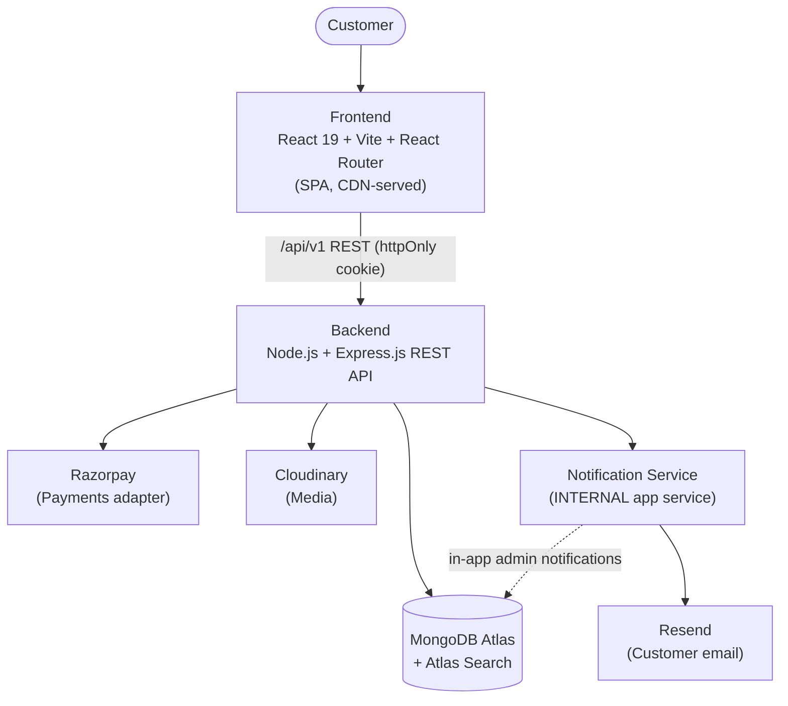
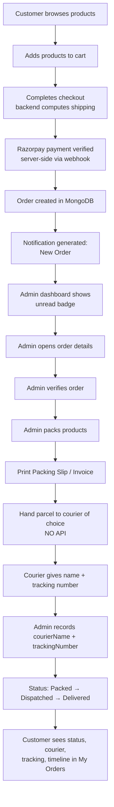
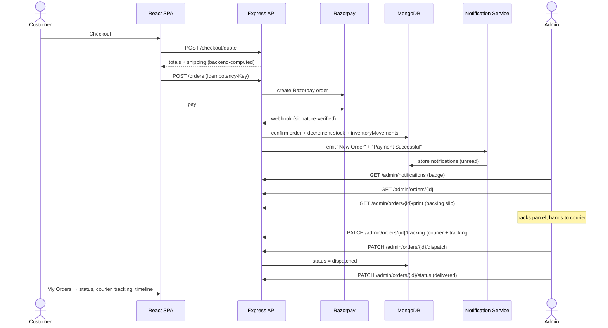

# MotoPark V2 — Order Fulfillment Workflow & Architecture

**Status:** 🔒 Finalized 2026-07-04 · Business-requirements update (manual fulfillment)
**Supersedes:** all prior Shiprocket/aggregator fulfillment language in the PRD/DB/API.

> MotoPark is a single-store business in Visakhapatnam. Fulfillment is handled **internally by the store owner** — no Shiprocket, no courier API, no aggregator, no auto label/serviceability.

---

## 1. System Architecture

The **Notification Service is an internal application service** — not a third-party notification/shipping provider.

---

## 2. Order Fulfillment Workflow (customer → delivery)

**Order status lifecycle:** `pending → confirmed → packed → dispatched → delivered` (+ `cancelled`, `returned`).

**Order detail page (admin) shows:** Customer Information · Shipping Address · Contact Number · Ordered Products · Variant Details · Payment Status · Total Amount · Order Status.

**Printable document (packing slip / invoice) contains:** MotoPark logo · Order ID · Customer Name · Shipping Address · Contact Number · Product List · Quantity · Payment Status · Date · Total Amount · *(optional future: QR code)*.

---

## 3. Sequence Diagram (paid order → dispatch → delivery)

---

## 4. Admin Workflow

1. **Notification badge** appears on the dashboard the moment a paid order arrives (`🔔 1 New Order`).
2. Admin **opens the order** → reviews customer/address/contact/items/variants/payment/total/status.
3. Admin **verifies** and **packs** the products.
4. Admin **prints** the packing slip and/or GST invoice, places it in/on the package.
5. Admin **hands the parcel to any courier** of their choice (no integration).
6. Courier returns **courier name + tracking number** → admin **records** them (`PATCH …/tracking`).
7. Admin advances status **Packed → Dispatched → Delivered** (`PATCH …/dispatch`, `PATCH …/status`).
8. Customer tracks progress in **My Orders**.

---

## 5. Notification Center (internal)

Replaces shipping integrations as the admin's operational hub.

| Notification | Trigger |
|---|---|
| 🔔 **New Order** | Order created after verified payment |
| 🔔 **Payment Successful** | Razorpay webhook verified |
| 🔔 **Low Stock** | Variant stock ≤ threshold (via `inventoryMovements`) |
| 🔔 **Return Request** | Customer requests a return |
| 🔔 **Contact Enquiry** | Contact / Lane-B enquiry submitted |

Each notification: **title · message · type · isRead · createdAt · relatedOrderId** *(priority = future)*. Dashboard shows unread count badge; `PATCH /admin/notifications/{id}/read` clears it.

---

## 6. Shipping (internal calculation)

- Flat **₹100** (default) per order; **free above ₹2,000**.
- Configurable in **Admin → Settings → Shipping**: `Flat Shipping Charge`, `Free Shipping Threshold`, `Enable/Disable Free Shipping`.
- **Backend is authoritative** — computes shipping at `/checkout/quote` and snapshots it on the order. Frontend never decides shipping. No third-party rate API.

---
*End of Order Fulfillment Workflow. Aligns with PRD §5.5–5.6, §5.13; DB §5, §7, §9; API §5, §7.*
